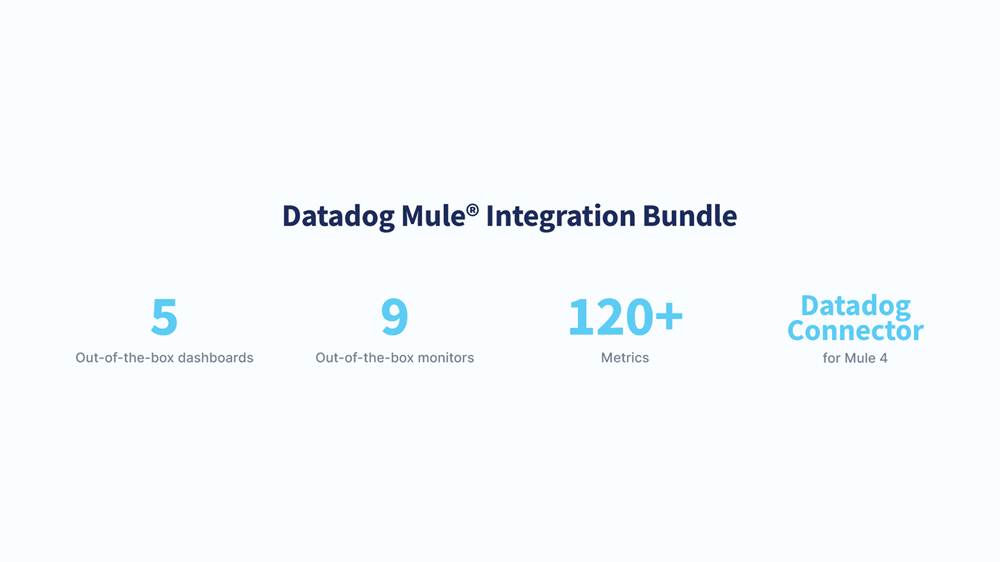

# CHANGELOG - Datadog Mule® Integration

## Overview

The Datadog Mule® Integration is an Agent-based integration that collects metrics from MuleSoft products and uploads them into Datadog. 

You can use these metrics to take advantage of the out-of-the-box dashboards and monitors or you can create your own visualizations.

## 1.2.1 / 2021-05-31
* [Fixed] Support for EU region in Anypoint Platform control plane.

## 1.2.0 / 2020-11-09
* [Added] Support to collect metrics from Anypoint API Manager and API Analytics.

## 1.1.0 / 2020-08-10
* [Added] Initial release in Datadog Marketplace
* [Added] Collection of metrics from Anypoint Platform, CloudHub, Agent Runtime Manager, Object Store v2, Access Management.
* [Added] 4 out-of-the-box dashboards: Infrastructure, Resource Allocatio and Usage, Development Optimizations, Cost Optimization
* [Added] 9 out-of-the-box monitors for CPU and memory consumption for on-premises and CloudHub applications and servers, and VM queues overloading.
* [Added] Datadog APM connector for Mule 4 applications.
