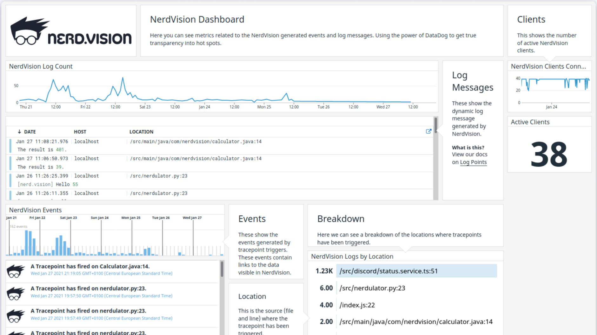

# nerdvision

## Overview

### What is NerdVision?

NerdVision is a live debugging platform that allows you to gather deep insight into your application at any time. NerdVision
allows you to install tracepoints into your application to collect data about the state of your applications without restarting or
changing the code.

After signup, this integration creates a dashboard and syncs all events and logs from the NerdVision group to your Datadog
organization.

#### Watchers and Conditionals

Use Conditionals to narrow the trigger of your tracepoint to the specific case you are interested in. Add watchers to enhance the
context to include data that are most important to the issue or are not part of the variable capture.

### NerdVision Datadog Dashboard

The Datadog dashboard gives you the insight you need to see where in your code the tracepoints are being triggered. Allowing you to
identify hotspots of debug activity.

### Events

Each tracepoint that is triggered will be sent to Datadog as an event, containing the appropriate tags, and a link to view the
data in NerdVision. Tracepoints allow you to gather the full stack and variables that are active at the frame the tracepoint is
triggered.

### Logs

With dynamic logging you can inject new log messages at any point of you code to add that extra data you missed. Each log message
that is triggered will be synced with Datadog as soon as it has been processed by NerdVision.

### Metrics

NerdVision produces metrics for online clients, and tracepoint triggers.

### Service Checks

NerdVision does not include any service checks.

## Setup

Get setup in just a few steps

1. Login to [nerd.vision](https://app.nerd.vision) and select the group you wish to integrate with Datadog.
1. Copy an **API Key** and **Application Key** from Datadog
1. Open NerdVision Group Settings **User > Group Settings > Datadog**
1. Paste the **API Key** and **Application Key** into NerdVision
1. Select the Datadog **Region** and click **Add Datadog to NerdVision**

If you have not already configured an application to use NerdVision, follow the [setup guide](https://app.nerd.vision/setup).

## Support

For support or requests, please contact NerdVision through the following channels:

Email: support@nerd.vision

Documentation is available [here](https://docs.nerd.vision/).

---
This application is made available through the Marketplace and is supported by a Datadog Technology Partner. [Click here](https://app.datadoghq.com/marketplace/app/nerdvision/pricing) to purchase this application.
