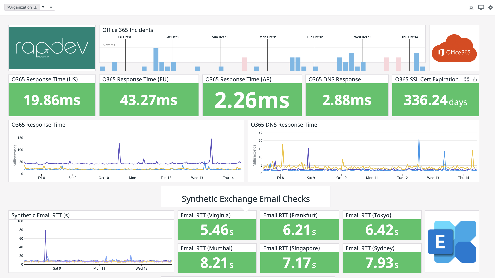
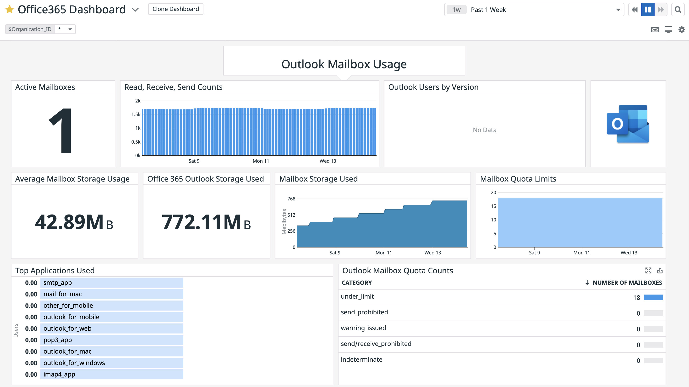
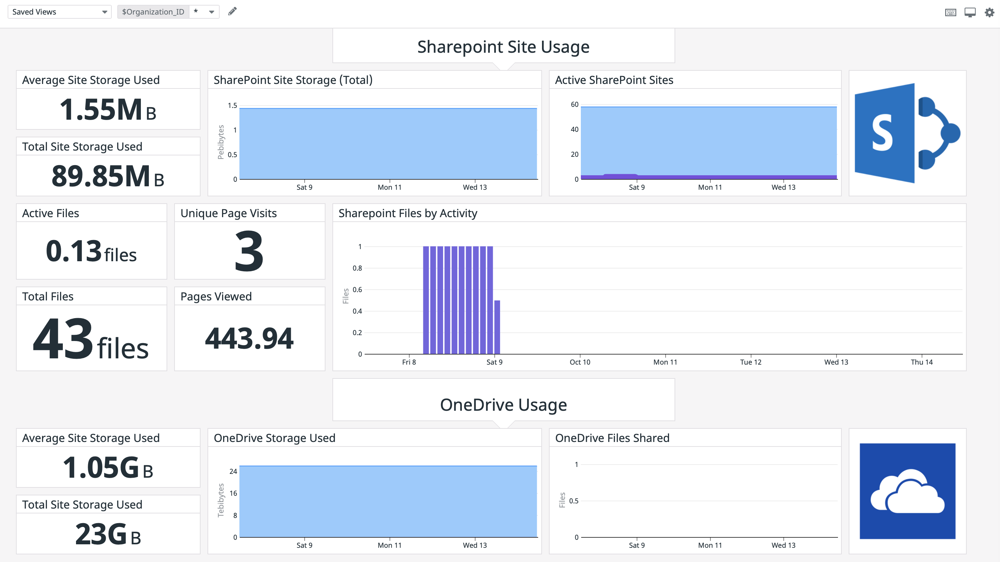
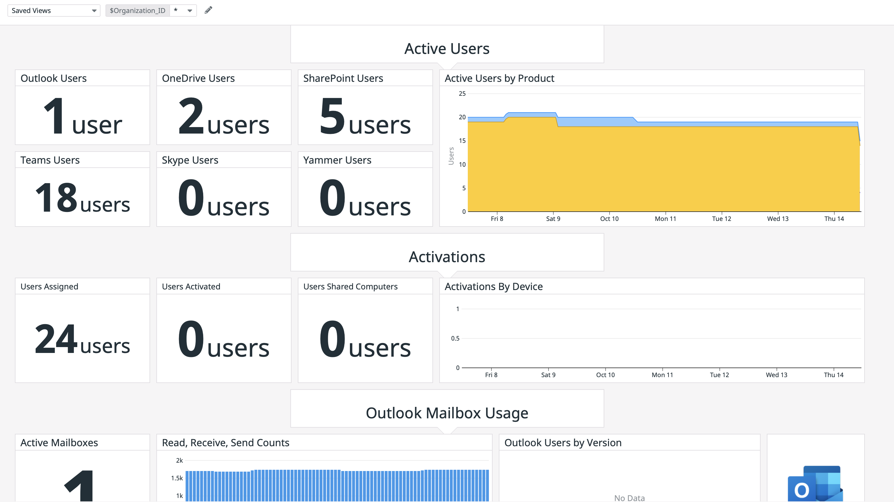
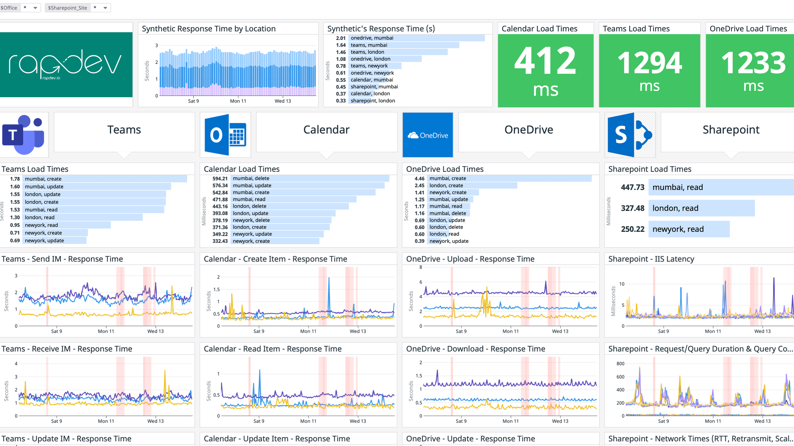

## Overview

[](https://www.youtube.com/watch?v=sBg8HI3Oz64)

The Microsoft Office 365 integration monitors product activity, usage and licensing of Exchange, Outlook, Sharepoint, OneDrive, Yammer, Teams, and Skype. The integration also runs synthetic operations in Outlook, Teams, and OneDrive to provide application performance monitoring from multiple locations worldwide. The Office 365 integration comes with a dashboard that allows you to filter based on User, OneDrive, Sharepoint URL, and more. It also uses Datadog Synthetic checks to validate that the Office 365 URLs are online and responding in an acceptable timeframe.

All integrations can be toggled on and off in the ```o365.yaml``` file as part of the integration.  Its recommended to disable any products you dont want to monitor to avoid usage of additional metrics.

Below are some screenshots of the dashboard that is included with the integration.

### Synthetic Mail and response times


### Outlook Mailbox metrics per user and devices


### Sharepoint site usage per URL


### License usage per product and user


### Teams, Calendar and OneDrive synthetics


## Setup

### Datadog Integration Install

Linux:
* `sudo -u dd-agent datadog-agent integration install --third-party datadog-o365==2.0.3`

Windows:
* `"C:\Program Files\Datadog\Datadog Agent\bin\agent.exe" integration install --third-party datadog-o365=2.0.3`

### Microsoft Office 365 Configuration

The Microsoft Office 365 integration requires permissions managed through your organization's Azure Active Directory as well as a dedicated "integration user account" to perform synthetic operations.

1. [Create a new Office 365 user account](https://support.microsoft.com/en-us/office/add-a-new-user-10d7c185-34d1-4648-9b1d-40c45305d2cb). The integration user account should not be shared with an active user in your organization. The integration user should be a native M365 user, assigned a standard O365 license, and configured to not require MFA. Retain the user account username, email address, and password for use in the datadog agent configuration step.

2. Add the `username` and `password` parameters to the `o365.d/o365.yaml` configuration file.  `username` should be the email address (UPN) of the Office 365 user created in step 1.

3. [Create a new Azure Active Directory Application Registration](https://docs.microsoft.com/en-us/azure/active-directory/develop/quickstart-register-app). For the delegated permissions, the effective permisions are those provided to the M365 user created in step 1. The App Registration permissions are an additional restriction limiting the scope of API calls allowed by the O365 Datadog integration.

	3.1. Create a [New Registration](https://portal.azure.com/#blade/Microsoft_AAD_IAM/ActiveDirectoryMenuBlade/RegisteredApps). Select a name that will clearly distinguish the application registration, e.g. *DatadogIntegration*.
	
	3.2. Configure the DatadogIntegration application API permissions. 

	- Select `Add a permission`, `Microsoft Graph`, and then `Application Permissions`. Add the following permissions:
		- Reports.Read.All

	- Select `Add a permission`, `Office 365 Management APIs`, and then `Application Permissions`. Add the following permissions:
		- ActivityFeed.Read
		- ActivityFeed.ReadDlp 
		- ServiceHealth.Read

	- Select `Add a permission`, `Microsoft Graph`, and then `Delegated Permissions`. Add the following permissions:
	  - AllSites.Read
		- Calendars.ReadWrite
		- Channel.ReadBasic.All
		- ChannelMessage.Send
		- email
		- Files.ReadWrite
		- offline_access
		- openid
		- profile
		- Team.ReadBasic.All

	- Select `Grant Admin Consent for {Organization}` to give consent to the app registration to consume the configured API permissions.

	3.3. From the app registration `Overview`, add the `Application (client) ID` and `Directory (tenant) ID` values to the `o365.d/o365.yaml` file as `client_id` and `tenant_id`, respectively.

	3.4. Select `Certificates & secrets` and `New client secret`. It's recommended to use `Never` for expiration unless you are actively managing the secret for your agent installation. Copy the client secret value promptly from the Microsoft Azure UI as the secret will be masked after a short period of time.

	3.5. Add the generated `client_secret` value to the `o365.d/o365.yaml` file.

4. [Create a Microsoft Teams group and channel](https://docs.microsoft.com/en-us/microsoftteams/get-started-with-teams-create-your-first-teams-and-channels) for the integration Teams synthetic checks.

	4.1. The Group/Teams name must be `dd-agent-synthetic`. The integration specifically looks for a Group/Teams called `dd-agent-synthetic`.

	4.2. Add the integration user created in step 1 to the Microsoft Teams `dd-agent-synthetic`. The synthetic check will use the default `General` channel to send and reply to messages.

5. [Configure the integration user account mailbox to auto-forward emails](https://docs.microsoft.com/en-us/exchange/recipients-in-exchange-online/manage-user-mailboxes/configure-email-forwarding) to `probe@synth-rapdev.io`. Optionally set your email forwarding configuration to disable copies of forwarded email.

6. [Modify the OneDrive storage configuration for the integration user account](https://docs.microsoft.com/en-us/onedrive/set-retention). Specify minimum of thirty (30) days and 1024 GB to prevent the integration user synthetic files from consuming all allocated storage. The default settings, unless modified by your organization, should be thirty (30) days and 1204 GB. 

7. Configure the email synthetic metrics by configuring the email mailbox setup in step 5 by adding `email_address: {integration_user@email.address}` in the `o365.d/o365.yaml`.

8. Add SharePoint sites to the `o365.d/o365.yaml` file to enable collection of SharePoint performance metrics. Ten (10) sites can be added under the configuration section `sharepoint_sites`. See the configuration example for syntax. The configured username and password for the performance synthetic user is used for the sharepoint login and the SharePoint site(s) must be readable by the configured user.

9. The integration configuration defaults to `probe_mode: true`, which will operate with application performance synthetics only. For your primary integration location, change `probe_mode: false` in the configuration yaml to enable report metrics and your tenant's Office 365 incident events.

10. Add the `office` tag to the integration configuration in `o365.d/o365.yaml` file to correspond to each office location from which the integration will be running synthetic checks, e.g.:
```
tags:
  - "office:boston"
```

11. [Restart the Agent](https://docs.datadoghq.com/agent/guide/agent-commands/?tab=agentv6v7).

### Validation

[Run the Agent's status subcommand](https://docs.datadoghq.com/agent/guide/agent-commands/?tab=agentv6v7#agent-status-and-information) and look for `o365` under the Checks section.

## Support
For support or feature requests please contact RapDev.io through the following channels: 

 - Email: integrations@rapdev.io 
 - Chat: [RapDev.io/products](https://rapdev.io/products)
 - Phone: 855-857-0222 

Tiered discounts for Office 365 users over 1,000 are available. Contact us at [integrations@rapdev.io](mailto:integration@rapdev.io).

---

Made with ❤️ in Boston

*This isn't the integration you're looking for? Missing a critical feature for your organization? Drop us a [note](mailto:integrations@rapdev.io) and we'll build it!!*

---

This application is made available through the Marketplace and is supported by a Datadog Technology Partner. [Click here](https://app.datadoghq.com/marketplace/app/rapdev-o365/pricing) to purchase this application.
