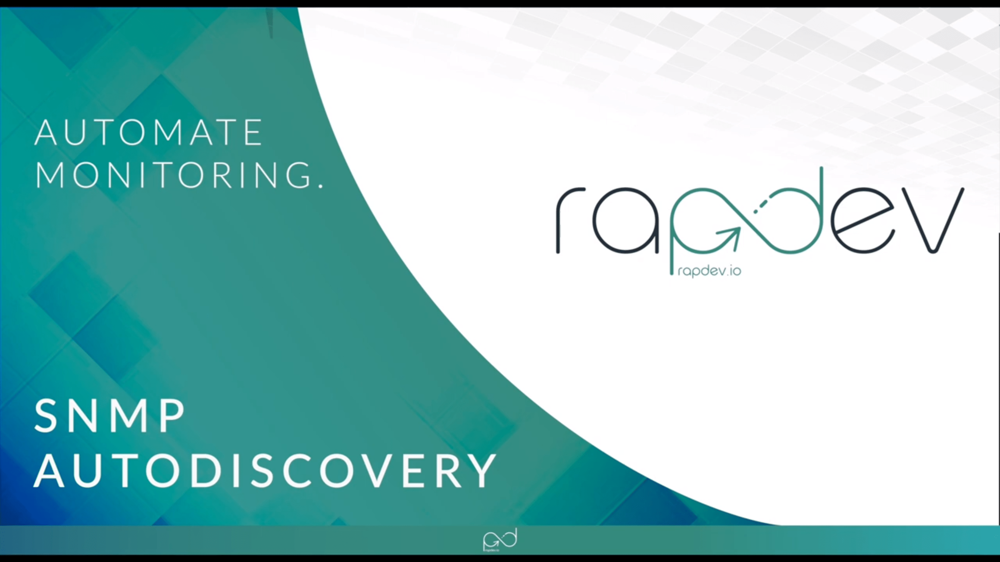

# RapDev SNMP Profiles
## Overview

The RapDev SNMP Profiles package supports over 150 device profiles natively, and has pre-built dashboards for all supported hardware devices to help you monitor them instantly. Several hundred hours have gone into tuning the profiles to ensure that they collect all relevant metrics with the necessary tags, including serial numbers, firmware versions, hardware versions, and more. This integration can be deployed in minutes and start monitoring, visualizing, and alerting immediately.

The integration will give you access to hundreds of YAML profiles, and will auto-deploy a number of new dashboards on your instance. It will then use the native Datadog SNMP Autodiscovery to automatically detect any supported hardware, and start polling the OIDs using the native Datadog SNMP integration.
There is no need for you to manage, edit, modify, or update any SNMP profiles on your Datadog agent or YAML. All of that is taken care of with this integration, and you can simply start monitoring and alerting.

### Pricing
##### *Volume pricing is only available upon request through a private offer*
| Units | Discount % | Cost/Unit |
|---|---|---|
| 1 - 99 | 0% | $6 |
| 100 - 499 | 10% | $5.40 |
| 500 - 999 | 25% | $4.50 |
| 1000 + | Variable | Contact [ddsales@rapdev.io](mailto:ddsales@rapdev.io) for more information |
Interested in using multiple RapDev integrations? Contact [ddsales@rapdev.io](mailto:ddsales@rapdev.io) for packaged pricing offers.

### Supported Devices
Below is a list of the currently supported devices, please visit our [website](https://www.rapdev.io/products/datadog-snmp-profiles) for a full updated list of all devices.

| Manufacturer | Model                 | Version       |
| ------------ | --------------------- | ------------- |
| APC          | Smart UPS             | All           |
| APC          | SmartCard             | All           |
| Arista       | Switch                | 7xxx          |
| Aruba        | Switch                | All           |
| AudioCodes   | Mediant SBC           | All           |
| Barracuda    | CloudGen Firewall     | 6,7,8         |
| Brocade      | VDX                   | All           |
| Checkpoint   | Gaia/Cloud Firewall   | 77+           |
| Cisco        | ASA                   | 5xxx          |
| Cisco        | ASR                   | All           |
| Cisco        | Catalyst              | All           |
| Cisco        | CUBE                  | IOS           |
| Cisco        | Nexus                 | 2k            |
| Cisco        | Nexus                 | 3k            |
| Cisco        | Nexus                 | 4k            |
| Cisco        | Nexus                 | 5k            |
| Cisco        | Nexus                 | 6k            |
| Cisco        | Nexus                 | 7k            |
| Cisco        | ISE                   | All           |
| Cisco        | ISR                   | 38XX, 44xx    |
| Cisco        | Nexus                 | All           |
| Cisco        | UCM                   | All           |
| Cisco        | UCS                   | M2, M3, M4    |
| Cisco        | WLC                   | All           |
| Citrix       | Netscaler             | All           |
| Dell         | iDRAC                 | 7,8,9         |
| Dell         | Powerconnect          | OS10          |
| Dell         | Powerconnect          | 3000          |
| F5           | Big-IP                | 9.4.x to 15.x |
| FortiNet     | FortiGate             | All           |
| HPE          | ProLiant Gen8-10      | iLO4,iLO5     |
| HPE          | Switch                |               |
| Ironport     | Mail                  | C3,C6,X1070   |
| Juniper      | SSG                   | All           |
| Kemp         | Loadmaster            | All           |
| Meraki       | CloudController       | CC            |
| Meraki       | Switch                | MR, MS, MX, Z |
| Nasuni       | Filer                 | All           |
| Palo Alto    | NextGen Firewall      | 9.x           |
| ServerTech   | PDU                   | Gen3, Gen4    |
| Sharp        | Printer               | All           |
| Steelhead    | Riverbed              | CX, EX        |
| VMware       | ESXi                  | 6.x           |

## Setup

1. Download and install the SNMP Profiles.

#### Linux
 Run the following command to download and install the latest RapDev profiles:
 `curl https://files.rapdev.io/datadog/scripts/install_snmp_profiles.sh | sh`

#### Windows
 Download this [Powershell script](https://files.rapdev.io/datadog/scripts/install_snmp_profiles.ps1) and run it as an Administrator on the Windows Server acting as the SNMP poller to install the latest profiles.

2. Fill in your conf.yaml with the necessary IP or network addresses for discovery. See the file `snmp-profiles\conf.yaml.example_rapdev` for example configuration.

## Support
For support or feature requests please contact RapDev.io through the following channels: 

 - Email: datadog-engineering@rapdev.io 
 - Chat: [rapdev.io](https://www.rapdev.io/#Get-in-touch)
 - Phone: 855-857-0222 

### Pricing
##### *Volume pricing is only available upon request through a private offer*
| Units | Discount % | Cost/Unit |
|---|---|---|
| 1 - 99 | 0% | $6 |
| 100 - 499 | 10% | $5.40 |
| 500 - 999 | 25% | $4.50 |
| 1000 + | Variable | Contact [ddsales@rapdev.io](mailto:ddsales@rapdev.io) for more information |
Interested in using multiple RapDev integrations? Contact [ddsales@rapdev.io](mailto:ddsales@rapdev.io) for packaged pricing offers.

---
Made with ❤️  in Boston

*This isn't the integration you're looking for? Missing a critical feature for your organization? Drop us a [note](mailto:datadog-engineering@rapdev.io) and we'll build it!!*
