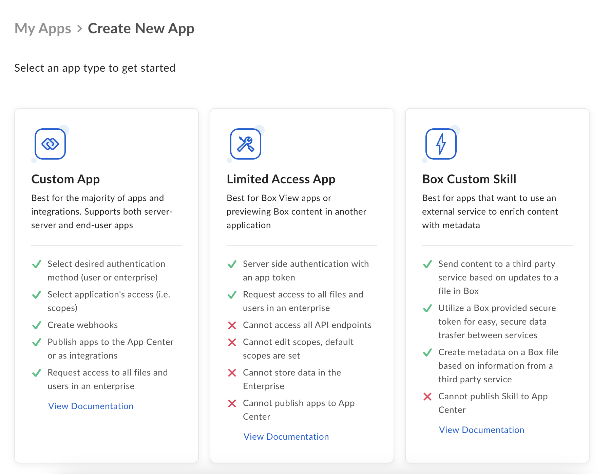
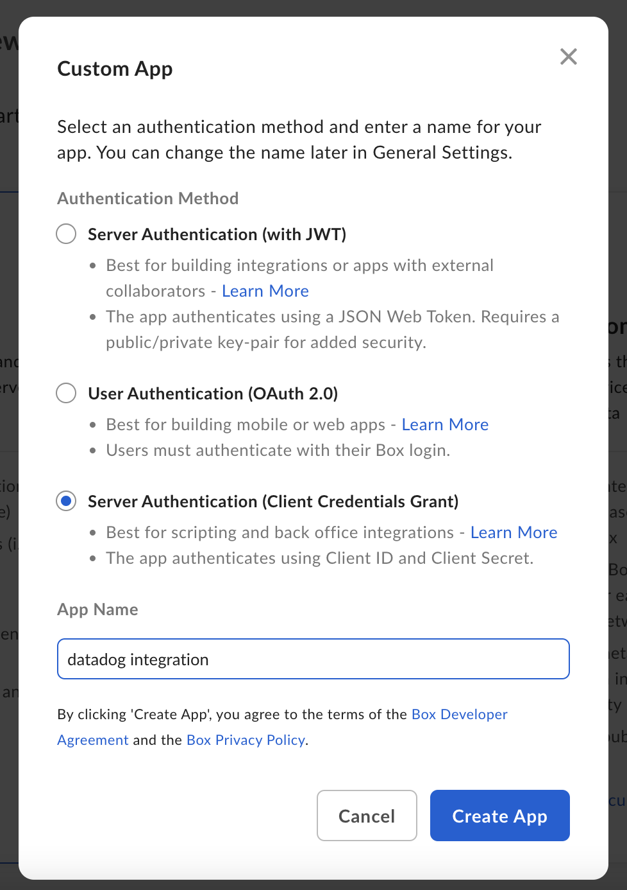
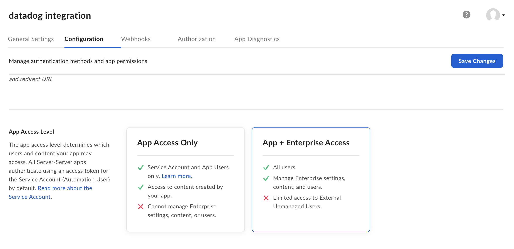
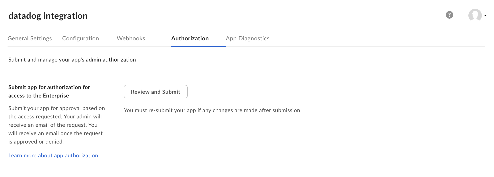
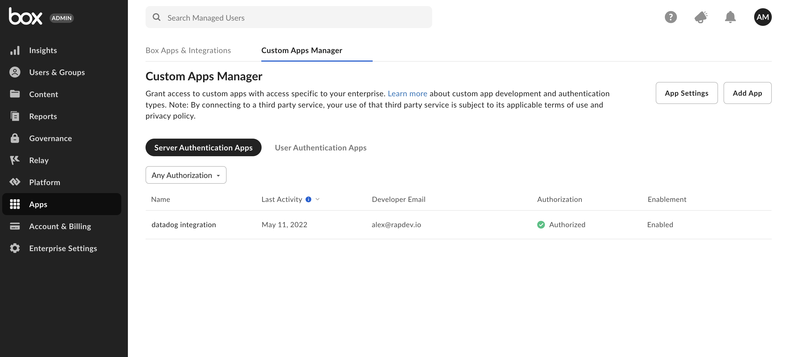

# Box Integration
## Overview
 This integration reports metrics about user storage in your [Box Enterprise Account](https://box.com/) and collects Box Admin Logs using the `admin_logs_streaming` endpoint. The following triggers are submitted to Datadog as logs:
 + [User Source Object](https://developer.box.com/guides/events/event-triggers/event-source/#user-source-object)
 + [Shield Events](https://developer.box.com/guides/events/event-triggers/shield-alert-events/)
 + [Sign Events](https://developer.box.com/guides/events/event-triggers/sign-events/)
### Metrics
This integration collects storage metrics about users in your Box enterprise account.
The following metrics are submitted:
```
rapdev.box.users.count
rapdev.box.users.storage.max
rapdev.box.users.storage.used
```
### Logs
This integration collects Box Admin Logs using the `admin_logs_streaming` endpoint.
The following triggers are submitted to Datadog as logs:
 + [User Source Object](https://developer.box.com/guides/events/event-triggers/event-source/#user-source-object)
 ```
 {
  "source": {
    "id": 11446498,
    "type": "user",
    "address": "900 Jefferson Ave, Redwood City, CA 94063",
    "avatar_url": "https://www.box.com/api/avatar/large/181216415",
    "created_at": "2012-12-12T10:53:43-08:00",
    "job_title": "CEO",
    "language": "en",
    "login": "ceo@example.com",
    "max_upload_size": 2147483648,
    "modified_at": "2012-12-12T10:53:43-08:00",
    "name": "Aaron Levie",
    "notification_email": {
      "email": "notifications@example.com",
      "is_confirmed": true
    },
    "phone": 6509241374,
    "space_amount": 11345156112,
    "space_used": 1237009912,
    "status": "active",
    "timezone": "Africa/Bujumbura"
  }
}
 ```
 + [Shield Events](https://developer.box.com/guides/events/event-triggers/shield-alert-events/)
 ```
 {
  "source":null,
  "created_by":{
    "type":"user",
    "id":"2",
    "name":"Unknown User",
    "login":""
  },
  "action_by":null,
  "created_at":"2019-12-20T11:38:56-08:00",
  "event_id":"97f1b31f-f143-4777-81f8-1b557b39ca33",
  "event_type":"SHIELD_ALERT",
  "ip_address":"10.1.2.3",
  "type":"event",
  "session_id":null,
  "additional_details":{
    "..."
  }
}
 ```
 + [Sign Events](https://developer.box.com/guides/events/event-triggers/sign-events/)
 ```
 "additional_details": {
    "sign_request": {
        "sign_request_id": "123e4567-e89b-12d3-a456-426614174000",
        "sign_request_short_id": "426614174000",
        "status": "sent",
        "signer_ip_address": null,
        "requestor_ip_address": "",
        "files": [
            {
                "id": "1234567890",
                "type": "file",
                "name": "example_doc.pdf",
                "parent": {
                    "id": "987654321",
                    "type": "folder"
                }
            }
        ],
        "requestor": {
            "id": "13579246",
            "type": "user",
            "name": "John Doe",
            "login": "johndoe@box.com"
        },
        "signer": null,
        "template": {
            "id": "987abC5423",
            "template_type": "Signing",
            "name": "Work Contact"
        },
        "batch_send": {
            "id": "W23YVL46"
        },
        "sender_message": {
            "subject": "Can you please sign this document?",
            "message": "This document shows the terms agreed to on the phone."
        },
        "forward": null
    }
}
 ```
### Dashboards
This integration provides an out-of-the-box dashboard named **Box Integration Overview**. The dashboard populates as metrics and logs are collected. 

In order for the Agent to collect logs, set `logs_enabled: true` in the main `datadog.yaml` file.

## Setup
### Prerequisites
You must have the Datadog Agent installed and running on a host. You also need to be able to connect to that host in order to configure the Agent and Integration YAML files.
### Installation
For Linux, use`sudo -u dd-agent datadog-agent integration install --third-party datadog-rapdev_box==1.0.0`.

For Windows, use `C:\Program Files\Datadog\Datadog Agent\bin\agent.exe integration install --third-party datadog-rapdev_box==1.0.0`.
1. In the [Box Developer](https://developer.box.com/), navigate to **My Apps** > **Create New App** and click **Custom App**.

    
    
2. Select **Server Authentication (Client Credentials Grant)**, enter a name for your app, and click **Create App**.

    
    
3. In the **Configuration** tab, click **App + Enterprise Access** and click **Save Changes**.

    
    
4. Navigate to the **Authorization** tab and click **Review and Submit**.

    
    
5. Grant access and authorize your custom app in the **Custom Apps Manager**.

   
   
6. Return to the Developer Console and select your app. 
    - In **General Settings**, take note of the Enterprise ID and navigate to **Configuration**.
    - Take note of the Client ID, then fetch and copy the Client Secret.
    - You need the API key of the Datadog organization you are submitting data to.
7. Add your API key, Enterprise ID, Client ID, and Client Secret to the following example and paste this into the integration's `conf.yaml` file.
```
conf.d/rapdev_box.d/rapdev_box.yaml
```
```
init_config:
instances:
  - box_url: "https://api.box.com/"
    dd_url: "https://app.datadoghq.com"
    dd_api_key: '<datadog api key>'
    enterprise_id: "<enterprise id>"
    client_id: "<client id>"
    client_secret: "<client secret>"
    admin_logs_enabled: false
```
By default, logs are disabled. To enable them, set `admin_logs_enabled: false` to `admin_logs_enabled: true`.

## Support
For support or feature requests, contact RapDev.io through the following channels:
- Support: datadog-engineering@rapdev.io
- Sales: sales@rapdev.io
- Chat: [rapdev.io](https://www.rapdev.io/#Get-in-touch)
- Phone: 855-857-0222
### Pricing
Interested in using multiple RapDev integrations? Contact [ddsales@rapdev.io](mailto:ddsales@rapdev.io) for packaged pricing offers.
---
Made with ❤️ in Boston
*This isn't the integration you're looking for? Missing a critical feature for your organization? Drop RapDev a [note](mailto:datadog-engineering@rapdev.io), and we'll build it!!*
---
This application is made available through the Marketplace and is supported by a Datadog Technology Partner. [Click here](https://app.datadoghq.com/marketplace/app/rapdev-box/pricing) to purchase this application.
