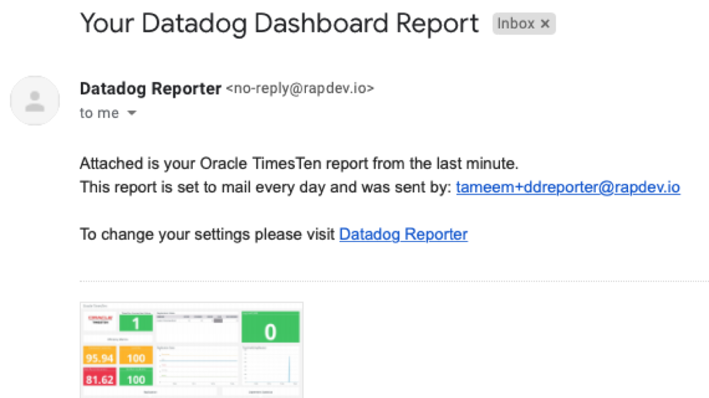
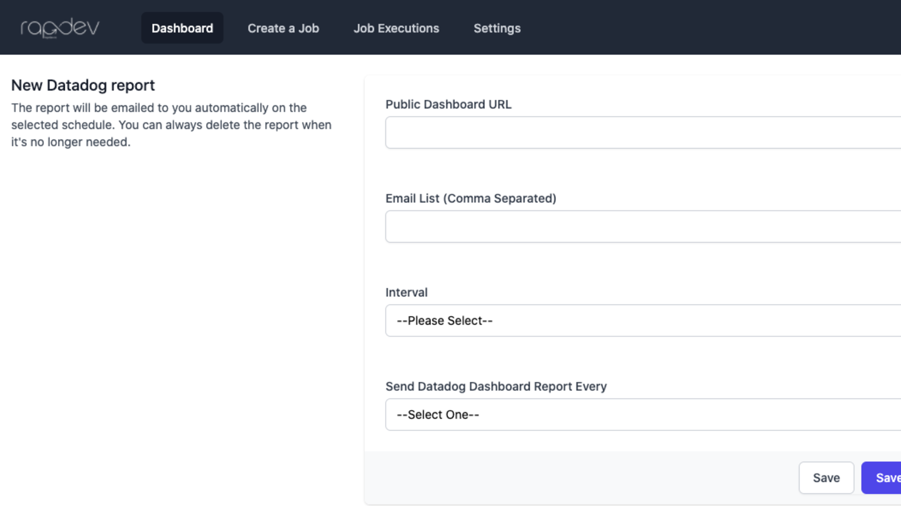
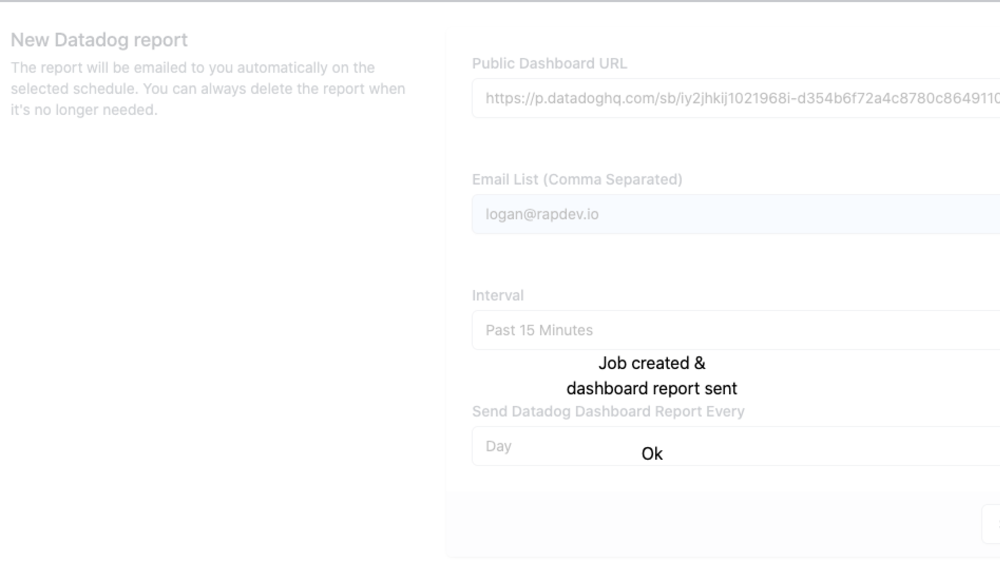

# Datadog Reporter

## Overview

Datadog Reporter allows you to schedule reports and email them out on a set interval. You can pick any of your existing dashboards, add the URL to the reporter web application, and set the mailing interval to send it out. The report will be emailed to your users as an attachment that they can open to view.  There is currently no limit to the number of reports you can generate and send.

This integration will setup a new dashboard in your Datadog instance called **Datadog Reporter**.  The application can be accessed directly by going to the dashboard and creating a new user from that iFrame.  *Your Datadog account will NOT work in the DD Reporter application.  You must register a seperate account*

### Sample Email Report

### Report Configuration Page

## Setup
You can use Public or Private dashboards with the reporter.  To start navigate to the **Datadog Reporter Dashboard** and **create a new account**. Your Datadog username and password will not work.  

For **Public Dashboards** do the following:

1. Paste the link to any public Datadog dashboard

2. Add the list of emails you want to send the report to

3. Select the frequency and timeframe for your dashboards

4. Click save and send

You will see a loading screen for a few seconds, then get redirected to your dashboard where you will find a list of your reporting jobs.

Once the job is saved, you'll get a confirmation.

Your reports will be sent by email as an attachement as shown above.

For **Private Dashboards** do the following:

1. Create a new Datadog account that has RO access, and verify that you can login using it.

2. Navigate to the **Settings** tab, and enter an API Key, Application Key, and a the Username and Password for your RO account.

3. Navigate to *Create a Job*, and click on the *Linked Datadog Account*

4. Select a dashboard from the dropdown menu.

5. Add the list of emails you want to send the report to

6. Select the frequency and timeframe for your dashboards

7. Click save and send

Your reports will be sent by email as an attachement as shown above.

## Support

For support or feature requests please contact RapDev.io through the following channels: 

 - Email: integrations@rapdev.io 
 - Chat: [RapDev.io/products](https://rapdev.io/products)
 - Phone: 855-857-0222 
 
---
 Made with ❤️ in Boston

*This isn't the integration you're looking for? Missing a critical feature for your organization? Drop us a [note](mailto:integrations@rapdev.io) and we'll build it!!*

---
 This application is made available through the Marketplace and is supported by a Datadog Technology Partner. [Click here](https://app.datadoghq.com/marketplace/app/rapdev-reporter/pricing) to purchase this application.
