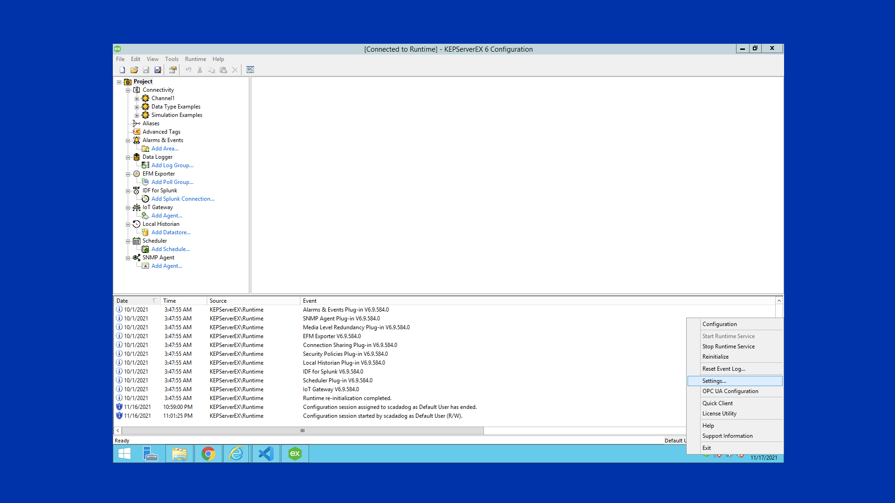
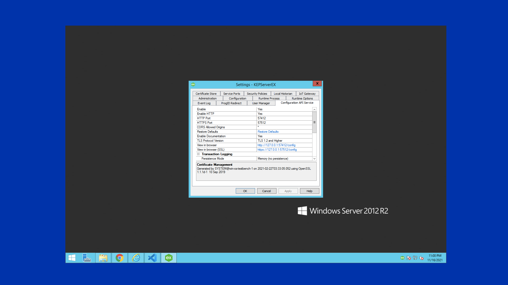
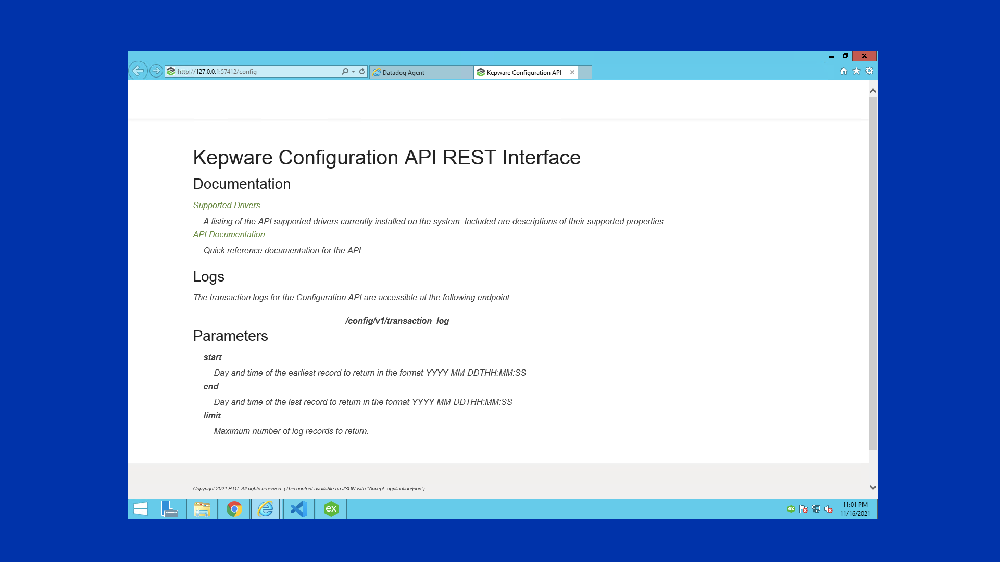
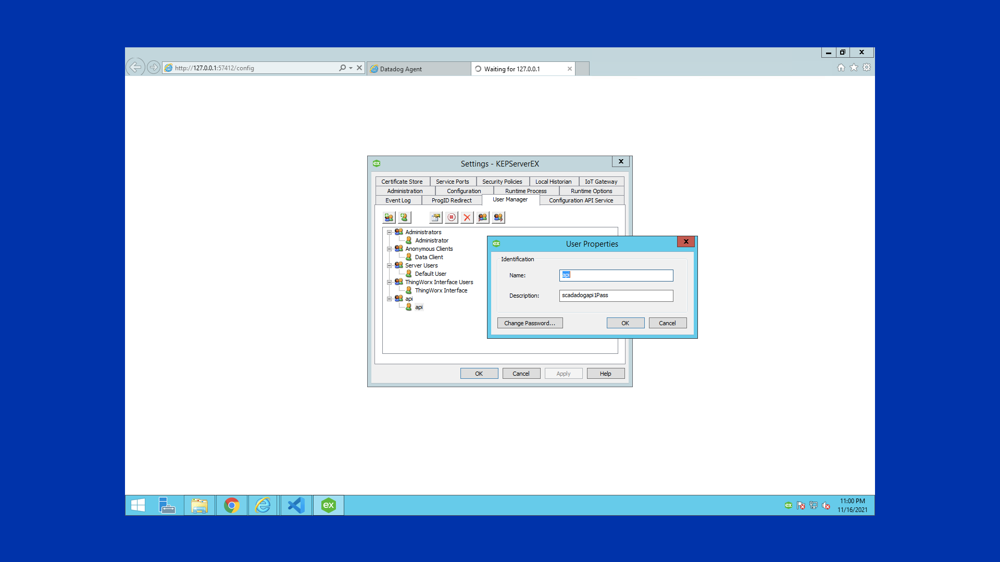
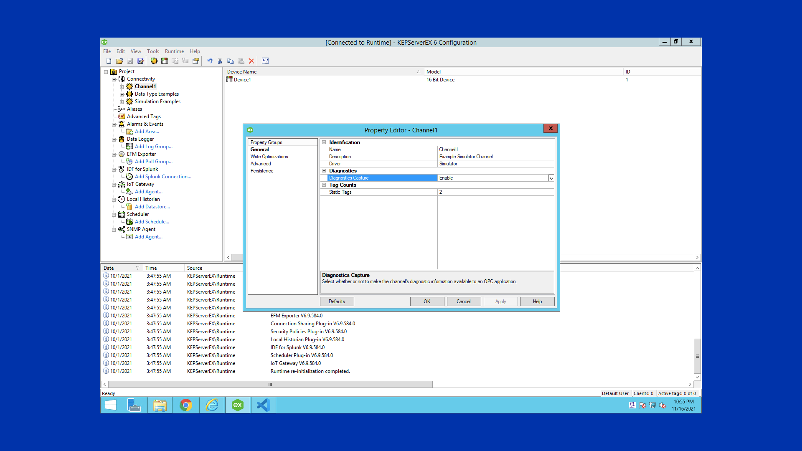

# Scadamods Kepserver

## Overview
The Scadamods Kepserver integration monitors any changes to channels, devices, and tags. The integration provides a stream of the events from the Kepserver Event log, letting you see the events in real-time on your Datadog dashboard. Through Kepserver's Configuration API, this integration gathers details that allow you to verify the configuration of channels, devices, and tags implemented on each Kepserver instance.

## Setup

### Prerequisites
* You should have an instance of Kepserver installed on your host. Don't have Kepserver yet? Download a trial version [here][12].
    - Currently Supported Version
        - [KepserverEx 6][13]
    - System Requirements
        - 1.0 GHz processor (2.0 GHz Recommended)
        - 1 GB installed RAM
        - 530 MB available disk space
        - Ethernet Card
        - Super VGA (800x600) or higher resolution video

* You must be able to connect to your Kepserver Instance and have Administrator privileges to enable the Configuration API.

* You must have a Datadog Agent installed on the same host where the Kepserver Instance is installed. 

* The host server must be capable of sending metrics to Datadog through appropriate network configurations set up for the host server. (Typically, industrial systems require firewall rules or a proxy setup to allow traffic to an external connection such as [https://www.datadoghq.com/][14]. For more information, email [support@scadamods.com][15].)

### Prepare the Kepserver Configuration API
To make REST API calls to the KEPserverEX Configuration API, make sure your Kepserver user account has the appropriate level of permissions. For more information, see the User Permissions section of Kepware's [Secure KEPServerEX Deployment Guide][10].

Follow the steps to enable the Configuration API and set up your Kepserver integration to read object properties. The ability to modify and create objects is also possible through this Kepserver API, but it is not a feature of the Kepserver integration. For more information on setting up the Configuration API, see Kepware's [API Made Easy Guide][11].

#### Setup steps
1. On the local machine where KEPServerEX is installed, right-click on the **Administration** icon located in the system tray and select **Settings**. Open the KEPServerEX menu by right-clicking on the icon located on the Windows tray. 

    

2. Open the **Configuration API Service** tab and ensure that the settings are configured as follows:
    - `Enable: Yes`
    - `Enable HTTP: Yes`
    - `CORS Allowed Origins: *`
        - **Note**: CORS stands for Cross Origin Domain Sharing. Putting an asterisk in this field allows all domains—regardless of origin—to access the API endpoints. This is helpful when developing a custom web client. For a more secure mode, enter a comma-separated list of domain specifications.
    - Leave all other options at their default settings.

    

3. Click **Apply** to save the modified settings.

4. Locate the **View in browser** setting and click `http://127.0.0.1:57412/config`. 
    - A web browser that displays the documentation for the Configuration API opens. The “Supported Drivers” section lists all the drivers installed in addition to associated properties that are accessible through the API. The “APIDocumentation” section lists all supported endpoints and HTTP commands. 
    - Enter the administrative credentials or created user for the API (See the [Kepserver documentation][10] to learn how to add a new user with access to the API.)
    
    

5. Click **OK** to exit **KEPServerEX Settings**.

6. (Optional) Create a user under a user group with a specific username and password that grants the least privileges for the REST API. 
    - Add a new user group and then add a user under the **User Manager** tab. You can then addConfiguration API privileges according to the created user.
    

> Additional Support can be found in [KepserverEx Installation Guide][10].

### Prepare the Kepserver Communication Diagnostics

System tags provide general error feedback to client applications, allow operational control when a device is actively collecting data, and allow visibility of a channel or device's standard properties. Statistics tags are used to provide feedback to client applications regarding the operation of the channel communications in the server. Statistics tags are only available when diagnostics are enabled. The Kepserver integration only provides a select number of system and statistics metrics as defined in [`metadata.csv`][7]. Only channels that have enabled diagnostics are read by the Kepserver integration.

**Note**: If there are errors when writing to read/write system tags, verify that the authenticated user has the appropriate permissions.

#### Setup steps
1. Right-click on the channel in the **Project View** and click **Properties** | **Enable Diagnostics**. 

    

2. Alternatively, double-click on the channel and select **Enable Diagnostics**. Users may enable diagnostics after channel creation.


### Install the Kepserver Integration
To install the Kepserver check on your host:

```
sudo ‐u dd‐agent datadog‐agent integration install --third-party datadog-scadamods_kepserver==1.0.0`
```


### Configuration

1. **Make sure that the [Configuration API is enabled][4] on your Kepserver.**

2. Configure the Agent to connect to KEPserverEX. Edit `scadamods_kepserver.d/conf.yaml`, in the `conf.d/` folder at the root of your [Agent's configuration directory][5]. See the [sample `scadamods_kepserver.d/conf.yaml`][6] for all available configuration options. 

> Note: Certificate security is currently not supported as of v1.0.0 of the integration. 

   ```yaml
   init_config:

   instances:
     - host: http://127.0.0.1
       port: 57412
       user: username
       password: password
       config_api_url: /config/v1/project
       eventlog_api_url: /config/v1/event_log
       kepserver_tag_filters:
        - /channels/*
        - /channels/Channel1/*
   ```
3. [Restart the agent][7]

### Log collection

_Available for Agent versions >6.0_

1. Collecting logs is disabled by default in the Datadog Agent, enable it in your `datadog.yaml` file:

   ```yaml
   logs_enabled: true
   ```

2. Add this configuration block to your `scadamods_kepserver.d/conf.yaml` file to start collecting your Kepserver logs:

   ```yaml
    logging_endpoint: https://http-intake.logs.datadoghq.com/v1/input/
   ```

3. [Restart the Datadog Agent][16].

### Validation
1. [Run the Agent's status subcommand][17] and look for `scadamods_kepserver` under the Checks section.

Alternatively, you can get detailed information about the integration using the following command.
```
sudo ‐u dd‐agent datadog‐agent check scadamods_kepserver
```

## Data Collected

### Metrics

See [metadata.csv][7] for a list of metrics provided by this integration.

### Events

The Kepserver check sends all event logs provided by the Kepserver event log API. 

### Service Checks

**scadamods_kepserver.can_connect**:<br>
Returns `CRITICAL` if the Agent is unable to connect to and collect metrics from the monitored Kepserver instance, otherwise returns `OK`.

## Troubleshooting

### 1. Error Unauthorized Access 

Symptom: The Kepserver check reports `CRITICAL` when it is unable to connect to the Kepserver instance.

Logs: The Kepserver check logs the following error message:
```Failed to retrieve Kepserver Event Logs: 401 Client Error: Unauthorized for url: http://127.0.0.1:57412//config/v1/event_log?```

Recommendations:

- Verify that the Kepserver instance is running.
- Confirm that the user has access to the Kepserver API endpoint by going to `http://127.0.0.1:57412//config/v1/event_log?` url in a web browser.
- If the user does not have access to the Kepserver API endpoint, create a user with the appropriate permissions.
- Navigate to the Kepserver Administration page and create a new user with the appropriate permissions.
- Confirm the Configuration API Service is enabled on the Kepserver instance, by navigating to the tab and selecting 'Yes' for the 'Enable' option.
- Confirm the Kepserver API endpoint is the same as the 'View in browser' link on the Configuration API Services tab.
- Confirm that the username and password is correct in the `scadamods_kepserver.d/conf.yaml` file.

### 2. OPC-UA Metric Collection Failed

Description: The OPC-UA metrics come from the system diagnostics feature of Kepserver. The system diagnostics feature is disabled by default and requires users to enable it under the OPC-UA properties for the project. The 'node_id' is the reference to the server that the OPC-UA metrics are collected from. If the server is not running, the 'node_id' will fail to be found by the client. The 'node_id' is defaulted to 'ns=2' for the Kepserver instance. If this needs to be modified contact support@scadamods.com.

Symptom: The Kepserver check does not capture OPC-UA metrics for system diagnostics.

Logs: The Kepserver check logs the following error message:

``` OPC UA metric request failed: "The node id refers to a node that does not exist in the server address space."(BadNodeIdUnknown)```

Recommendations:
- Verify that the Kepserver has System Diagnostics enabled.
- Navigate to the Kepserver Project Properties page and select the OPC-UA tab. Verify that the `Log diagnostics` option is set to `Yes`. 


Need more help? Contact [Datadog support][8], or [support@scadamods.com][15].

## Support
For support or feature requests, contact Scadamods:
- Email: support@scadamods.com

---
Made with Industrial 💪 Strength

*This isn't the integration you're looking for? Missing a critical feature for your organization? Drop us a [note][15], and we'll build it!!*

---
This application is made available through the Datadog Marketplace and is supported by a Datadog Technology Partner. [Purchase this application here][18].

## Further Reading

Additional helpful documentation, links, and articles:

- [KesperverEx Manual][9]

[1]: https://raw.githubusercontent.com/DataDog/dd-agent/5.10.1/conf.d/scadamods_kepserver.yaml.example
[2]: https://app.datadoghq.com/account/settings#agent
[3]: https://docs.datadoghq.com/agent/guide/agent-configuration-files/#agent-configuration-directory
[4]: https://github.com/DataDog/integrations-core/blob/master/scadamods_kepserver/datadog_checks/scadamods_kepserver/data/conf.yaml.example
[5]: https://docs.datadoghq.com/agent/guide/agent-commands/#start-stop-and-restart-the-agent
[6]: https://docs.datadoghq.com/agent/guide/agent-commands/#agent-status-and-information
[7]: https://github.com/DataDog/integrations-core/blob/master/scadamods_kepserver/metadata.csv
[8]: https://docs.datadoghq.com/help/
[9]: https://github.com/scadadog/public_artifacts/blob/master/kepserverex-manual.pdf
[10]: https://www.kepware.com/getattachment/6882fe00-8e8a-432b-b138-594e94f8ac88/kepserverex-secure-deployment-guide.pdf
[11]: https://www.kepware.com/getattachment/f38ad6fe-be2e-40cc-9481-11d9e85c980c/configuration-api-made-easy.pdf
[12]: https://www.kepware.com/en-us/products/kepserverex/
[13]: https://www.kepware.com/getattachment/f5b80059-b32a-43ae-8fec-42183f890755/KEPServerEX_installation_guide_v610.pdf
[14]: https://www.datadoghq.com/
[15]: mailto:support@scadamods.com
[16]: https://docs.datadoghq.com/agent/guide/agent-commands/?tab=agentv6v7#start-stop-and-restart-the-agent
[17]: https://docs.datadoghq.com/agent/guide/agent-commands/?tab=agentv6v7#agent-information
[18]: https://app.datadoghq.com/marketplace/app/scadamods-kepserver/pricing
