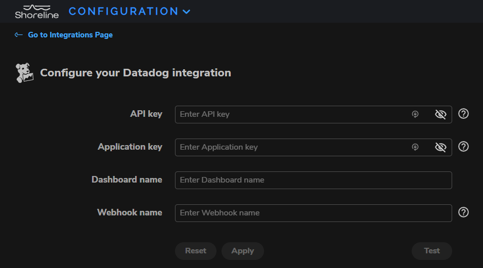

# Shoreline.io

## Overview

Shoreline incident automation enables DevOps and Site Reliability Engineers (SREs) to interactively **debug at scale** and quickly **build remediations** to eliminate repetitive work.

The debug and repair feature allows you to execute commands in real-time across your server farm without needing to SSH into the servers individually. You can execute anything that can be typed at the Linux command prompt such as Linux commands, shell scripts, and calls to cloud provider APIs, and turn these debug sessions into automations connected to Datadog monitors.

The Shoreline app automatically executes the automation when the monitor is triggered, significantly reducing Mean Time to Repair (MTTR) and manual work.

Shoreline helps everyone on call be as good as your best SRE. Shoreline arms your on-call team with debugging tools and approved remediation actions, helping you fix incidents faster with fewer escalations and ensuring that incidents are fixed correctly the first time with fewer mistakes.

To get started, set up a trial account on [Shoreline][3].

## Setup

### Installation

Follow the steps below to install and configure Shoreline's Datadog integration.

1. [Install the Shoreline Agent](https://docs.shoreline.io/installation) on your hosts.
2. [Install the Shoreline integration](https://docs.shoreline.io/integrations/datadog#install-the-shoreline-integration) from [Shoreline's Datadog marketplace tile][10].
3. Navigate to your **Shoreline UI > Integrations > Datadog** page (i.e., `https://<SHORELINE_UI_URL>/integrations/datadog/`) to [install the Datadog integration](https://docs.shoreline.io/integrations/datadog#install-the-datadog-integration).

#### Shoreline Agent

An Agent is an efficient, non-intrusive process running in the background of your monitored hosts. Agents collect, aggregate, and send data from the host and all connected pods and containers to Shoreline's backend, which uses the data to create metrics.

Agents serve as the secure link between Shoreline and your environment's resources. Agents can execute actions on your behalf, from simple Linux commands to remediation playbooks. Operational language statements pass an API request through Shoreline's backend and to the relevant Agents which execute the command across targeted resources.

Agents receive commands from Shoreline's backend and take automatic remediation steps based on the alarms, actions, and bots you configure. These objects work in tandem to monitor your fleet and dispatch the appropriate response if something goes wrong.

Install Shoreline Agents on every host you want Shoreline to monitor and act upon.

To install the Shoreline Agent, follow one of three methods:

1. [Kubernetes][5]
2. [Kubernetes via Helm][6] 
3. [Virtual Machines][7]

#### Datadog integration

To configure Shoreline's Datadog integration, you need a Datadog API and Application Key.

**Note**: See [Shoreline's Datadog Integration][4] documentation for detailed setup instructions.

## Uninstallation

1. Navigate to your **Shoreline UI > Integrations > Datadog** page (i.e., `https://<SHORELINE_UI_URL>/integrations/datadog/`).  
2. Click the **Uninstall** button.

   **Note**: Uninstalling the integration automatically removes the associated Datadog dashboard and webhook from your Datadog account.

Once you've canceled the subscription, Shoreline will reach out to confirm and disconnect your account.

## Support

Contact Shoreline through email for support and requests.

Email: [support@shoreline.io][2]
For more information, see the [Shoreline documentation][9].

[1]: images/integrate_shoreline_and_datadog.png
[2]: mailto:support@shoreline.io
[3]: https://shoreline.io/datadog?source=DatadogMarketplace
[4]: https://docs.shoreline.io/integrations/datadog
[5]: https://docs.shoreline.io/installation/kubernetes
[6]: https://docs.shoreline.io/installation/kubernetes#install-with-helm
[7]: https://docs.shoreline.io/installation/virtual-machines
[8]: images/link_icon.svg
[9]: https://docs.shoreline.io/
[10]: /account/settings#integrations/shoreline-integration
