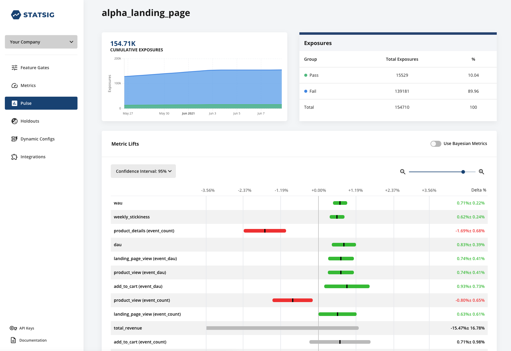
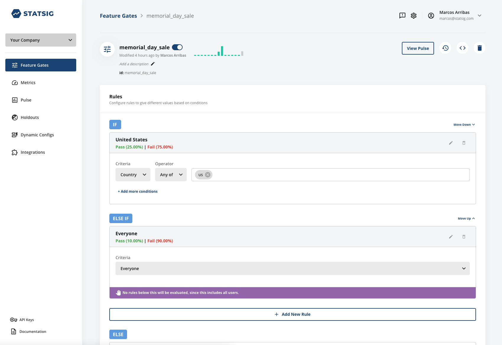
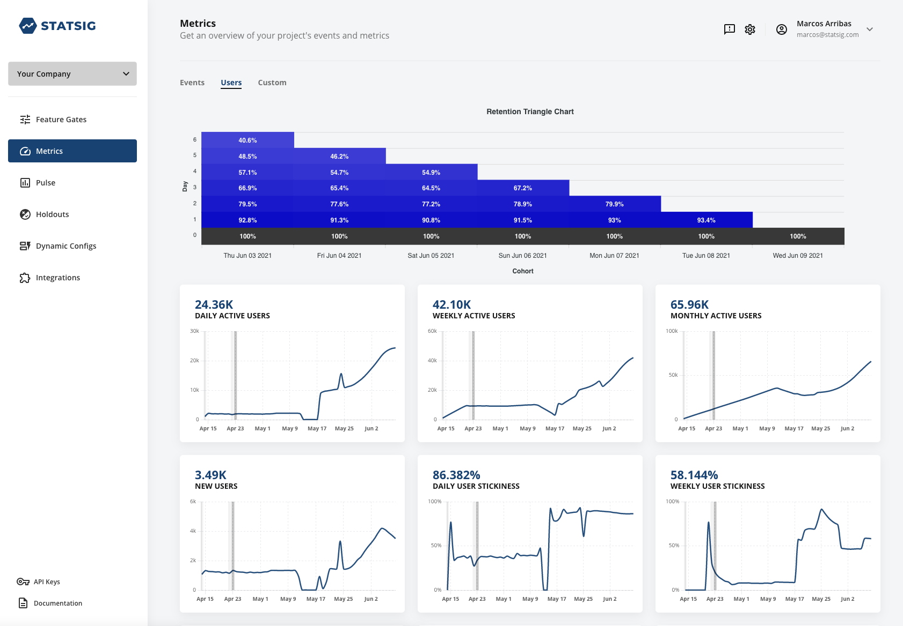

# Statsig

## Overview

[Statsig](https://www.statsig.com) helps companies safely AB test features in production before rolling them out, avoiding product debates and costly ship mistakes. But what makes Statsig unique is that by simply logging events, experiments are run automatically showing you the impact of all new features-without extra configuration. Other platforms make it difficult to know how a feature is performing, requiring you to create metrics, calculate sample sizes and segment users for every experiment you want to run. Statsig is different: we automate the grunt work away such that AB tests are always running, automatically, and you will always know how your features are performing.

As a team of former Facebook engineers, we created Statsig to give everyone the same infrastructure that enables hundreds of teams to launch thousands of features with precision.

This offering in the marketplace provides access to Statsig's platform. If you are already a Statsig customer, you can connect your account to Datadog with the [Datadog Statsig Integration](/integrations/statsig) to set up the integration.

## Data Collected

### Metrics

See [metadata.csv](https://github.com/DataDog/marketplace/blob/master/statsig/metadata.csv) for a list of metrics provided by this integration and the description of each.

### Events

The Statsig integration sends configuration change events on Statsig to Datadog. For instance, new or updated feature gates or new integrations enabled.

## Setup

- Click [here](https://console.statsig.com/sign_up) to sign up for your Statsig account.

## Uninstallation

First, cancel your subscription in Plan & Pricing. Statsig will then reach out to confirm and disconnect your account.

## Support

Need help? Contact Statsig Support at support@statsig.com or [contact us here](https://www.statsig.com/contact)
