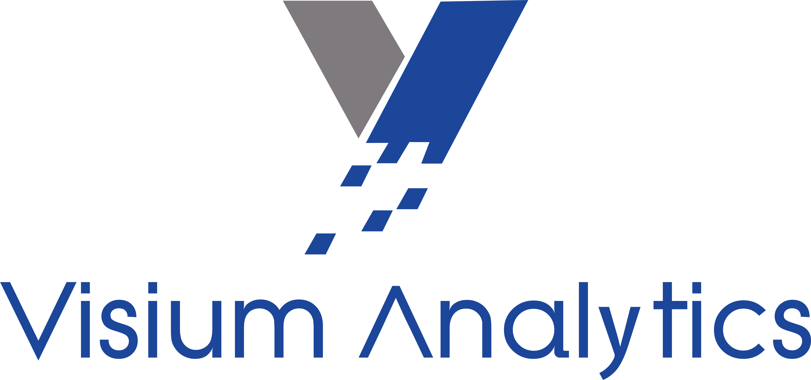
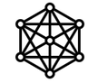

# CyGraph

## Overview

CyGraph is cloud-based SaaS (software as a service) technology offered by Visium Technologies. CyGraph ingests a variety of data types and metrics from assets, services, applications, and other tools. These metrics and data streams are then stored and analyzed in What is CyGraph, delivering a context overlay to an enterprise’s data. 

CyGraph is offered as an integration to be used in conjunction with Datadog to provide contextual and system level assessments within the cybersecurity domain, as well as to improve the efficiency and reliability of systems by eliminating noise. This enables clients to quickly identify risks and root causes associated with network vulnerabilities in real-time by using Visium Analytics’ TrueContext technology.

### CyGraph features

#### Cyber Health Scoring System

The Cyber Health Scoring System uses CVE (Common Vulnerabilities and Exposures) and CVSS (Common Vulnerabilities Scoring System) to measure the health of networks and their devices by scoring the severity of different vulnerabilities present in a network. 

#### Visualization graph 

The visualization graph allows users to see the different devices on a network in addition to the different threats, vulnerabilities, and exploits. With this graph, users can see which devices (nodes) are connected, which dangers are associated with corresponding devices, and the relationships (edges) between those devices (including infections). Visualization helps users to determine the root cause of a problem and the path of the problem (that is, which devices may be at risk for infection). 

#### Database querying

Users can make database queries with CyGraph Query Language (CyQL). Users can also create queries by simply clicking on different nodes and/or edges within the visualization graph to customize searches (for example: for simplification, to search for a particular threat, etc.). Additionally, queries can be saved for later usage. 

## Setup

Visium has three onboarding steps:
1. Visium has been notified of your purchase, and an onboarding representative will send you a unique link (URL) to Visium's onboarding form shortly.
2. Visium asks that you complete the onboarding form with your contact information, along with your Datadog API and application keys, which are required by Visium to populate nodes into the CyGraph data set.
3. The onboarding representative will schedule time with you to layout data-modeling options, as well as provide new environment setup details.

At the conclusion of these steps, you can begin experiencing the context-based, threat awareness benefits of CyGraph to understand threats, root causes, and mitigations in real-time with Visium’s TruContext analysis.

The input data for CyGraph from Datadog defines graph nodes and edges, with certain properties (required and optional) defined for each node and edge. There is also a configuration file for node and edge visual styles. Future updates are planned for continuous enhancement of CyGraph from streaming data sources.

To ensure success of a pilot project, Visium provides professional services to the level deemed necessary. These resources support standing up a CyGraph service, integrating with data sources (for example: alerts, vulnerabilities, and network flow records), training, and engaging in some preliminary security operations. The level of effort needed varies depending on the particular data sources and integration requirements.

## Support

For support, email support@visiumtechnologies.com or call Visium support at (703) 273-0383.
